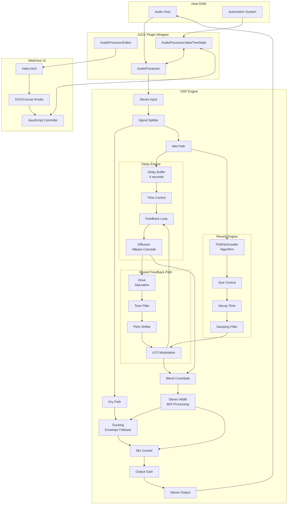

# Design Document: Flowstate Audio Plugin

## Overview

Flowstate is a hybrid spatial audio effect plugin that unifies delay and reverb processing into a single interconnected feedback ecosystem. The plugin architecture consists of three primary layers:

1. **DSP Engine Layer (C++)**: Real-time audio processing using JUCE framework, implementing delay and reverb algorithms with shared feedback routing
2. **Parameter Management Layer (C++)**: JUCE AudioProcessorValueTreeState managing 21 parameters with automation support and state serialization
3. **UI Layer (HTML/CSS/JavaScript)**: Custom web-based interface rendered through JUCE WebBrowserComponent with bidirectional parameter bridge

The core innovation is the Blend control that crossfades between delay and reverb wet signals while maintaining independent wet/dry mixing. Both engines share a common feedback path where character effects (drive, tone, shimmer) are applied, enabling seamless morphing between discrete echoes and dense reverberant textures.

**Target Platforms**: macOS (AU/VST3), Windows (VST3)  
**Framework**: JUCE 7.x  
**UI Technology**: HTML5/CSS3/JavaScript via WebBrowserComponent  
**Sample Rates**: 44.1kHz - 192kHz  
**Buffer Sizes**: 32 - 2048 samples

## Architecture

### High-Level System Architecture



### Component Interaction Flow

1. **Audio Input**: Host sends stereo audio buffer to AudioProcessor::processBlock()
2. **Signal Split**: Input splits into dry path (preserved) and wet path (processed)
3. **Parallel Processing**: Wet signal processes through both Delay_Engine and Reverb_Engine simultaneously
4. **Feedback Ecosystem**: Both engines feed back through shared character processing (drive, tone, shimmer, modulation)
5. **Blend Crossfade**: Delay and reverb wet outputs crossfade based on Blend parameter
6. **Ducking**: Dry signal envelope attenuates blended wet signal
7. **Width Processing**: M/S encoding adjusts stereo width of wet signal only
8. **Final Mix**: Wet and dry signals combine according to Mix parameter
9. **Output**: Final gain stage and output to host

### File Structure

```
FlowstatePlugin/
├── Source/
│   ├── PluginProcessor.h/cpp          # Main AudioProcessor class
│   ├── PluginEditor.h/cpp             # WebBrowserComponent container
│   ├── Parameters.h                   # Parameter definitions and IDs
│   ├── DSP/
│   │   ├── DelayEngine.h/cpp          # Delay processing with diffusion
│   │   ├── ReverbEngine.h/cpp         # FDN/Schroeder reverb algorithm
│   │   ├── FeedbackProcessor.h/cpp    # Shared feedback path effects
│   │   ├── DuckingProcessor.h/cpp     # Envelope follower and ducking
│   │   ├── ShimmerProcessor.h/cpp     # Pitch shifting for shimmer
│   │   ├── ModulationEngine.h/cpp     # LFO for time/diffusion modulation
│   │   ├── StereoWidthProcessor.h/cpp # M/S encoding for width control
│   │   └── ReverseBuffer.h/cpp        # 3-second rolling buffer
│   └── Bridge/
│       └── ParameterBridge.h/cpp      # JS ↔ C++ communication
├── WebUI/
│   ├── index.html                     # Complete UI (embedded CSS/JS)
│   └── fonts/
│       └── Inter/                     # Local font files
└── FlowstatePlugin.jucer              # JUCE project file
```

## Components and Interfaces

### 1. AudioProcessor (PluginProcessor)

**Responsibilities**:
- Manage AudioProcessorValueTreeState with 21 parameters
- Route audio through DSP engine components
- Handle state serialization/deserialization
- Provide host tempo information to delay engine

**Key Methods**:
```cpp
class FlowstateProcessor : public juce::AudioProcessor
{
public:
    void processBlock(AudioBuffer<float>&, MidiBuffer&) override;
    void prepareToPlay(double sampleRate, int samplesPerBlock) override;
    void releaseResources() override;
    
    AudioProcessorEditor* createEditor() override;
    bool hasEditor() const override { return true; }
    
    void getStateInformation(MemoryBlock& destData) override;
    void setStateInformation(const void* data, int sizeInBytes) override;
    
private:
    AudioProcessorValueTreeState parameters;
    
    DelayEngine delayEngine;
    ReverbEngine reverbEngine;
    FeedbackProcessor feedbackProcessor;
    DuckingProcessor duckingProcessor;
    StereoWidthProcessor widthProcessor;
    ModulationEngine modulationEngine;
    ReverseBuffer reverseBuffer;
    
    AudioBuffer<float> dryBuffer;
    AudioBuffer<float> wetBuffer;
    AudioBuffer<float> delayWetBuffer;
    AudioBuffer<float> reverbWetBuffer;
};
```

**Parameter Definitions** (Parameters.h):
```cpp
namespace ParameterIDs
{
    // Delay parameters
    const String delayTime { "delayTime" };
    const String delaySync { "delaySync" };
    const String delayDivision { "delayDivision" };
    const String delayFeedback { "delayFeedback" };
    const String delayDiffusion { "delayDiffusion" };
    
    // Reverb parameters
    const String reverbSize { "reverbSize" };
    const String reverbDecay { "reverbDecay" };
    const String reverbDamping { "reverbDamping" };
    
    // Core controls
    const String blend { "blend" };
    const String mix { "mix" };
    
    // Modulation
    const String modRate { "modRate" };
    const String modDepth { "modDepth" };
    
    // Character
    const String drive { "drive" };
    const String tone { "tone" };
    
    // Ducking
    const String duckSensitivity { "duckSensitivity" };
    
    // Shimmer
    const String shimmerEnabled { "shimmerEnabled" };
    const String shimmerPitch { "shimmerPitch" };
    
    // Reverse
    const String reverseMode { "reverseMode" }; // 0=OFF, 1=REVERB, 2=DELAY, 3=BOTH
    
    // Freeze
    const String freezeEnabled { "freezeEnabled" };
    
    // Output
    const String outputGain { "outputGain" };
    const String stereoWidth { "stereoWidth" };
}
```

### 2. DelayEngine

**Responsibilities**:
- Maintain circular delay buffer (4 seconds at max sample rate)
- Implement tempo-synced and free delay timing
- Apply feedback with safety limiting
- Apply cascaded allpass filters for diffusion

**Interface**:
```cpp
class DelayEngine
{
public:
    void prepare(double sampleRate, int samplesPerBlock);
    void reset();
    
    void setDelayTime(float milliseconds);
    void setDelayTimeFromTempo(double bpm, int division); // division: 0-17 (1/32 to 1/1, straight/dotted/triplet)
    void setFeedback(float amount); // 0.0 to 1.0
    void setDiffusion(float amount); // 0.0 to 1.0
    
    void process(AudioBuffer<float>& buffer, AudioBuffer<float>& feedbackInput);
    
private:
    AudioBuffer<float> delayBuffer;
    int writePosition = 0;
    float currentDelayInSamples = 0.0f;
    
    std::array<AllpassFilter, 4> diffusionFilters; // Cascaded allpass for diffusion
    
    float calculateDelayFromDivision(double bpm, int division);
    float applyFeedbackLimiter(float sample);
};
```

**Diffusion Implementation**:
- 0% diffusion: Direct delay taps, no allpass processing
- 100% diffusion: 4 cascaded allpass filters with randomized delays (5-15ms range)
- Allpass filters create dense echo patterns without coloring frequency response

### 3. ReverbEngine

**Responsibilities**:
- Implement Feedback Delay Network (FDN) or Schroeder reverb
- Control early reflection density via size parameter
- Apply decay time scaling
- Apply frequency-dependent damping

**Interface**:
```cpp
class ReverbEngine
{
public:
    void prepare(double sampleRate, int samplesPerBlock);
    void reset();
    
    void setSize(float size); // 0.0 to 1.0
    void setDecayTime(float seconds); // 0.1 to 20.0
    void setDamping(float amount); // 0.0 to 1.0
    
    void process(AudioBuffer<float>& buffer);
    
private:
    // FDN implementation with 8 delay lines
    std::array<AudioBuffer<float>, 8> fdnDelayLines;
    std::array<int, 8> fdnDelayLengths;
    std::array<int, 8> fdnWritePositions;
    std::array<OnePoleLowpass, 8> dampingFilters;
    
    juce::dsp::Matrix<float> feedbackMatrix; // Householder matrix for FDN
    
    void updateDelayLengths(float size, double sampleRate);
    void updateDampingFilters(float damping, double sampleRate);
};
```

**FDN Algorithm**:
- 8 parallel delay lines with prime-number lengths (based on size parameter)
- Householder feedback matrix for diffusion and decorrelation
- One-pole lowpass filters in each delay line for damping
- Decay time controls feedback gain in the matrix

### 4. FeedbackProcessor

**Responsibilities**:
- Apply drive saturation (tape-like waveshaping)
- Apply tone filtering (high-frequency rolloff)
- Route signal to shimmer processor when enabled
- Integrate with modulation engine

**Interface**:
```cpp
class FeedbackProcessor
{
public:
    void prepare(double sampleRate, int samplesPerBlock);
    
    void setDrive(float amount); // 0.0 to 1.0
    void setTone(float amount); // 0.0 to 1.0
    
    void process(AudioBuffer<float>& buffer, ShimmerProcessor* shimmer, bool shimmerEnabled);
    
private:
    juce::dsp::FirstOrderTPTFilter<float> toneFilter;
    
    float applySaturation(float sample, float drive);
};
```

**Drive Saturation**:
- Soft clipping using tanh() waveshaping
- Input gain staging: `sample * (1.0 + drive * 3.0)`
- Output compensation to maintain perceived loudness

**Tone Filter**:
- First-order lowpass filter
- Cutoff frequency: 20kHz (tone=0%) to 800Hz (tone=100%)
- Applied after saturation to tame harsh harmonics

### 5. ShimmerProcessor

**Responsibilities**:
- Pitch-shift feedback signal by selected interval
- Maintain audio quality during pitch shifting
- Minimize latency and artifacts

**Interface**:
```cpp
class ShimmerProcessor
{
public:
    void prepare(double sampleRate, int samplesPerBlock);
    void reset();
    
    void setPitchShift(float semitones); // -24.0 to +24.0
    
    void process(AudioBuffer<float>& buffer);
    
private:
    // Using JUCE's built-in pitch shifter or custom implementation
    juce::dsp::ProcessorChain<
        juce::dsp::Gain<float>,
        // Custom pitch shifter using overlap-add or granular synthesis
    > processorChain;
    
    // Overlap-add buffers
    AudioBuffer<float> grainBuffer;
    int grainSize = 2048;
    float pitchRatio = 1.0f;
};
```

**Pitch Shifting Algorithm**:
- Overlap-add method with Hann windowing
- Grain size: 2048 samples (adaptive based on pitch ratio)
- 50% overlap for smooth transitions
- Pitch ratio calculation: `pow(2.0, semitones / 12.0)`

### 6. DuckingProcessor

**Responsibilities**:
- Analyze dry signal amplitude using envelope follower
- Generate attenuation coefficient based on sensitivity
- Apply smooth gain reduction to wet signal

**Interface**:
```cpp
class DuckingProcessor
{
public:
    void prepare(double sampleRate);
    
    void setSensitivity(float sensitivity); // 0.0 to 1.0
    
    float processEnvelope(const AudioBuffer<float>& dryBuffer);
    void applyDucking(AudioBuffer<float>& wetBuffer, float envelopeValue);
    
private:
    float envelopeState = 0.0f;
    float attackTime = 0.01f;  // 10ms
    float releaseTime = 0.2f;  // 200ms
    
    float attackCoeff = 0.0f;
    float releaseCoeff = 0.0f;
    
    void updateCoefficients(double sampleRate);
};
```

**Envelope Follower**:
- Peak detection with separate attack/release times
- Attack: 10ms (fast response to transients)
- Release: 200ms (smooth bloom in gaps)
- Threshold: Dynamic based on sensitivity parameter

**Attenuation Calculation**:
```
threshold = -40dB + (sensitivity * 30dB)  // -40dB to -10dB range
if (envelope > threshold):
    attenuation = 1.0 - (sensitivity * 0.8)  // Up to 80% reduction
else:
    attenuation = 1.0  // No reduction
```

### 7. ModulationEngine

**Responsibilities**:
- Generate sine wave LFO
- Modulate delay time and reverb diffusion simultaneously
- Provide smooth parameter modulation without clicks

**Interface**:
```cpp
class ModulationEngine
{
public:
    void prepare(double sampleRate);
    void reset();
    
    void setRate(float hz); // 0.01 to 5.0 Hz
    void setDepth(float depth); // 0.0 to 1.0
    
    float getNextModulationValue(); // Returns -1.0 to +1.0
    
private:
    float phase = 0.0f;
    float phaseIncrement = 0.0f;
    double sampleRate = 44100.0;
};
```

**Modulation Application**:
- Delay time: `actualTime = baseTime * (1.0 + modValue * depth * 0.1)` (±10% variation)
- Reverb diffusion: Modulates allpass filter delays in FDN

### 8. StereoWidthProcessor

**Responsibilities**:
- Implement M/S (Mid-Side) encoding and decoding
- Scale side signal based on width parameter
- Preserve mono compatibility

**Interface**:
```cpp
class StereoWidthProcessor
{
public:
    void setWidth(float width); // 0.0 to 1.5 (0%=mono, 100%=normal, 150%=hyper-wide)
    
    void process(AudioBuffer<float>& buffer);
    
private:
    void encodeToMS(float& left, float& right, float& mid, float& side);
    void decodeFromMS(float mid, float side, float& left, float& right);
};
```

**M/S Processing**:
```
Encoding:
  mid = (left + right) / 2
  side = (left - right) / 2

Width scaling:
  side = side * width

Decoding:
  left = mid + side
  right = mid - side
```

### 9. ReverseBuffer

**Responsibilities**:
- Maintain 3-second rolling buffer
- Provide reverse playback for delay, reverb, or both
- Handle buffer wraparound smoothly

**Interface**:
```cpp
class ReverseBuffer
{
public:
    void prepare(double sampleRate, int samplesPerBlock);
    void reset();
    
    void write(const AudioBuffer<float>& input);
    void readReverse(AudioBuffer<float>& output, int mode); // mode: 0=OFF, 1=REVERB, 2=DELAY, 3=BOTH
    
private:
    AudioBuffer<float> circularBuffer;
    int writePosition = 0;
    int bufferLengthSamples = 0;
};
```

### 10. ParameterBridge

**Responsibilities**:
- Register JavaScript callback for UI → C++ communication
- Evaluate JavaScript for C++ → UI updates
- Maintain parameter synchronization

**Interface**:
```cpp
class ParameterBridge
{
public:
    ParameterBridge(FlowstateProcessor& processor, WebBrowserComponent& webView);
    
    void registerJavaScriptCallbacks();
    void updateUIParameter(const String& paramID, float value);
    
private:
    FlowstateProcessor& processor;
    WebBrowserComponent& webView;
    
    void handleMessageFromJS(const var& message);
};
```

**JavaScript → C++ Flow**:
1. User drags knob in UI
2. JavaScript calls `window.__juce__.postMessage(JSON.stringify({id: "blend", value: 0.75}))`
3. ParameterBridge::handleMessageFromJS() receives message
4. Updates AudioProcessorValueTreeState parameter
5. DSP engine reads new value in next processBlock()

**C++ → JavaScript Flow**:
1. DAW automation changes parameter
2. AudioProcessorValueTreeState listener detects change
3. ParameterBridge::updateUIParameter() called
4. Executes JavaScript: `webView.evaluateJavascript("window.flowstate.updateParam('blend', 0.75)")`
5. UI updates knob visual position

### 11. WebView UI Architecture

**HTML Structure** (index.html):
```html
<!DOCTYPE html>
<html>
<head>
    <meta charset="UTF-8">
    <style>
        /* Embedded CSS */
        body {
            margin: 0;
            width: 900px;
            height: 500px;
            background: #0E0E1A;
            font-family: 'Inter', sans-serif;
            overflow: hidden;
        }
        
        .section-delay { border-color: #3ECFCF; }
        .section-reverb { border-color: #E8A838; }
        .blend-knob { background: linear-gradient(135deg, #3ECFCF, #C8B8FF, #E8A838); }
        
        /* Knob styles, layout grid, etc. */
    </style>
</head>
<body>
    <div id="app">
        <!-- Delay Section (left) -->
        <div class="section section-delay">
            <div class="knob" data-param="delayTime"></div>
            <div class="knob" data-param="delayFeedback"></div>
            <div class="knob" data-param="delayDiffusion"></div>
        </div>
        
        <!-- Blend Section (center) -->
        <div class="section section-blend">
            <div class="knob blend-knob" data-param="blend"></div>
            <div class="knob" data-param="mix"></div>
        </div>
        
        <!-- Reverb Section (right) -->
        <div class="section section-reverb">
            <div class="knob" data-param="reverbSize"></div>
            <div class="knob" data-param="reverbDecay"></div>
            <div class="knob" data-param="reverbDamping"></div>
        </div>
        
        <!-- Bottom sections: Modulation, Character, Special -->
    </div>
    
    <script>
        // Embedded JavaScript
        window.flowstate = {
            params: {},
            
            init() {
                this.initKnobs();
                this.registerCallbacks();
            },
            
            initKnobs() {
                document.querySelectorAll('.knob').forEach(knob => {
                    const paramId = knob.dataset.param;
                    knob.addEventListener('mousedown', (e) => this.startDrag(e, paramId));
                });
            },
            
            startDrag(e, paramId) {
                const startY = e.clientY;
                const startValue = this.params[paramId] || 0.5;
                
                const onMove = (moveEvent) => {
                    const deltaY = startY - moveEvent.clientY;
                    const newValue = Math.max(0, Math.min(1, startValue + deltaY / 200));
                    this.updateParam(paramId, newValue);
                    this.sendToPlugin(paramId, newValue);
                };
                
                document.addEventListener('mousemove', onMove);
                document.addEventListener('mouseup', () => {
                    document.removeEventListener('mousemove', onMove);
                }, { once: true });
            },
            
            updateParam(paramId, value) {
                this.params[paramId] = value;
                const knob = document.querySelector(`[data-param="${paramId}"]`);
                const rotation = -135 + (value * 270); // -135° to +135°
                knob.style.transform = `rotate(${rotation}deg)`;
            },
            
            sendToPlugin(paramId, value) {
                if (window.__juce__) {
                    window.__juce__.postMessage(JSON.stringify({ id: paramId, value: value }));
                }
            },
            
            registerCallbacks() {
                // Called by C++ to update UI from automation
            }
        };
        
        window.flowstate.init();
    </script>
</body>
</html>
```

## Data Models

### Parameter State Model

All plugin state is managed through JUCE's AudioProcessorValueTreeState, which provides:
- Thread-safe parameter access
- Automatic DAW automation support
- Built-in undo/redo support
- XML serialization

**Parameter Ranges**:

| Parameter | ID | Range | Default | Unit |
|-----------|----|----|---------|------|
| Delay Time | delayTime | 1.0 - 2000.0 | 500.0 | ms |
| Delay Sync | delaySync | 0 - 1 | 0 | bool |
| Delay Division | delayDivision | 0 - 17 | 6 | enum |
| Delay Feedback | delayFeedback | 0.0 - 1.0 | 0.5 | normalized |
| Delay Diffusion | delayDiffusion | 0.0 - 1.0 | 0.3 | normalized |
| Reverb Size | reverbSize | 0.0 - 1.0 | 0.5 | normalized |
| Reverb Decay | reverbDecay | 0.1 - 20.0 | 2.0 | seconds |
| Reverb Damping | reverbDamping | 0.0 - 1.0 | 0.5 | normalized |
| Blend | blend | 0.0 - 1.0 | 0.5 | normalized |
| Mix | mix | 0.0 - 1.0 | 0.5 | normalized |
| Mod Rate | modRate | 0.01 - 5.0 | 0.5 | Hz |
| Mod Depth | modDepth | 0.0 - 1.0 | 0.0 | normalized |
| Drive | drive | 0.0 - 1.0 | 0.0 | normalized |
| Tone | tone | 0.0 - 1.0 | 0.5 | normalized |
| Duck Sensitivity | duckSensitivity | 0.0 - 1.0 | 0.0 | normalized |
| Shimmer Enabled | shimmerEnabled | 0 - 1 | 0 | bool |
| Shimmer Pitch | shimmerPitch | -24.0 - 24.0 | 12.0 | semitones |
| Reverse Mode | reverseMode | 0 - 3 | 0 | enum |
| Freeze Enabled | freezeEnabled | 0 - 1 | 0 | bool |
| Output Gain | outputGain | -60.0 - 6.0 | 0.0 | dB |
| Stereo Width | stereoWidth | 0.0 - 1.5 | 1.0 | normalized |

### Audio Buffer Model

The plugin maintains several internal audio buffers for signal routing:

```cpp
// In FlowstateProcessor
AudioBuffer<float> dryBuffer;           // Preserved input signal
AudioBuffer<float> wetBuffer;           // Combined wet signal
AudioBuffer<float> delayWetBuffer;      // Delay engine output
AudioBuffer<float> reverbWetBuffer;     // Reverb engine output
AudioBuffer<float> feedbackBuffer;      // Feedback path signal
```

Buffer lifecycle per processBlock():
1. Copy input to dryBuffer
2. Process wetBuffer through delay and reverb engines
3. Apply feedback processing
4. Blend delay and reverb outputs
5. Apply ducking, width, and mix
6. Write final output back to input buffer

### State Serialization Model

Plugin state is serialized to XML format:

```xml
<FlowstateState>
    <Parameters>
        <Parameter id="delayTime" value="500.0"/>
        <Parameter id="blend" value="0.5"/>
        <!-- All 21 parameters -->
    </Parameters>
    <UIState>
        <WindowSize width="900" height="500"/>
    </UIState>
</FlowstateState>
```

Serialization handled by:
```cpp
void FlowstateProcessor::getStateInformation(MemoryBlock& destData)
{
    auto state = parameters.copyState();
    std::unique_ptr<XmlElement> xml(state.createXml());
    copyXmlToBinary(*xml, destData);
}

void FlowstateProcessor::setStateInformation(const void* data, int sizeInBytes)
{
    std::unique_ptr<XmlElement> xmlState(getXmlFromBinary(data, sizeInBytes));
    if (xmlState.get() != nullptr)
        if (xmlState->hasTagName(parameters.state.getType()))
            parameters.replaceState(ValueTree::fromXml(*xmlState));
}
```


## Correctness Properties

*A property is a characteristic or behavior that should hold true across all valid executions of a system—essentially, a formal statement about what the system should do. Properties serve as the bridge between human-readable specifications and machine-verifiable correctness guarantees.*

### Property Reflection

After analyzing all acceptance criteria, I identified the following redundancies:
- Properties 13.3 and 14.5 both test smooth parameter changes without artifacts - combined into one property
- Properties 11.6 and 11.7 both test that width only affects wet signal - combined into one property
- Properties 15.7 and 18.6 both test local font loading - kept as single example
- Multiple range validation properties (1.1, 2.1, 2.4, 3.1-3.3, etc.) can be combined into a comprehensive parameter validation property
- Edge case examples for blend (4.2, 4.3, 4.4) and mix (4.6, 4.7) can be tested as part of crossfade properties

### Property 1: Parameter Range Validation

*For any* parameter in the plugin, setting a value within its defined range should be accepted, and values outside the range should be clamped to the valid range.

**Validates: Requirements 1.1, 2.1, 2.4, 3.1, 3.2, 3.3, 4.1, 5.1, 5.2, 6.1, 6.5, 7.2, 8.4, 11.1, 11.2**

### Property 2: BPM Sync Delay Time Calculation

*For any* valid BPM value (20-999) and any supported division (1/32 through 1/1, straight/dotted/triplet), the calculated delay time should equal `(60000 / BPM) * division_multiplier` where division_multiplier is the fractional note value.

**Validates: Requirements 1.2**

### Property 3: Mode Switching State Preservation

*For any* delay time value, switching from synced to free mode should preserve the current delay time in milliseconds, and switching back should recalculate based on current BPM.

**Validates: Requirements 1.5**

### Property 4: Feedback Limiting

*For any* feedback value above 90%, processing an input signal through the delay engine should never produce output samples exceeding unity gain (±1.0) after 100 feedback iterations.

**Validates: Requirements 2.2, 2.3**

### Property 5: Blend Crossfade Ratio

*For any* blend value from 0.0 to 1.0, the ratio of delay wet signal to reverb wet signal in the output should equal `(1.0 - blend) : blend`, with boundary cases: blend=0.0 outputs 100% delay, blend=1.0 outputs 100% reverb.

**Validates: Requirements 4.2, 4.3, 4.4, 21.7**

### Property 6: Mix Independence from Blend

*For any* combination of blend and mix values, changing blend should not affect the wet/dry ratio, and changing mix should not affect the delay/reverb ratio.

**Validates: Requirements 4.5**

### Property 7: Mix Crossfade Ratio

*For any* mix value from 0.0 to 1.0, the ratio of dry signal to wet signal in the output should equal `(1.0 - mix) : mix`, with boundary cases: mix=0.0 outputs 100% dry, mix=1.0 outputs 100% wet.

**Validates: Requirements 4.6, 4.7, 21.9**

### Property 8: Modulation Depth Zero Bypass

*For any* input signal, when modulation depth is set to 0%, the output should be identical to processing with no modulation engine active.

**Validates: Requirements 5.3**

### Property 9: Modulation Affects Multiple Targets

*For any* modulation depth greater than 0%, the LFO should simultaneously modulate both delay time and reverb diffusion parameters, with both showing periodic variation at the specified rate.

**Validates: Requirements 5.4**

### Property 10: LFO Waveform Shape

*For any* LFO rate, sampling the modulation output over one complete cycle should produce values that match a sine wave pattern within 1% tolerance.

**Validates: Requirements 5.5**

### Property 11: Drive Zero Bypass

*For any* input signal, when drive is set to 0%, the feedback path output should be identical to the input (no saturation applied).

**Validates: Requirements 6.2**

### Property 12: Tone Zero Bypass

*For any* input signal, when tone is set to 0%, the frequency spectrum of the feedback path output should match the input spectrum (no filtering applied).

**Validates: Requirements 6.6**

### Property 13: Ducking Sensitivity Zero Bypass

*For any* input signal, when duck sensitivity is set to 0%, the wet signal output should be identical to processing with no ducking active.

**Validates: Requirements 7.3**

### Property 14: Ducking Attenuates Wet Only

*For any* dry and wet signal combination, when ducking is active (sensitivity > 0%), the dry signal should pass through unchanged while the wet signal is attenuated based on dry signal amplitude.

**Validates: Requirements 7.4, 7.6, 21.2**

### Property 15: Shimmer Disabled Bypass

*For any* input signal, when shimmer is disabled, the feedback path output should have the same pitch content as the input (no pitch shifting applied).

**Validates: Requirements 8.2**

### Property 16: Shimmer Pitch Shift Amount

*For any* pitch interval from -24 to +24 semitones, when shimmer is enabled, the output frequency should equal the input frequency multiplied by `2^(semitones/12)`.

**Validates: Requirements 8.3**

### Property 17: Freeze Preserves Dry Signal

*For any* input signal, when freeze is active, the dry signal should pass through unchanged while the wet signal loops the captured content.

**Validates: Requirements 10.4**

### Property 18: Freeze Independence from Blend

*For any* blend value, when freeze is activated, the captured wet signal should reflect the current blend position, and changing blend while frozen should not affect the looped content.

**Validates: Requirements 10.5**

### Property 19: Stereo Width Mono Collapse

*For any* stereo input signal, when stereo width is set to 0%, the left and right output channels of the wet signal should be identical (mono).

**Validates: Requirements 11.3**

### Property 20: Width Affects Wet Signal Only

*For any* stereo input signal and any width value, the dry signal stereo image should remain unchanged while only the wet signal stereo width is modified.

**Validates: Requirements 11.6, 11.7, 21.8**

### Property 21: Parameter Smoothing

*For any* parameter, rapidly changing its value (e.g., 100 random changes per second) should produce output audio with no zipper noise or clicks (measured as no spectral energy above 20kHz).

**Validates: Requirements 13.3, 14.5**

### Property 22: State Serialization Round Trip

*For any* valid plugin state (all 21 parameters set to random valid values), serializing the state and then deserializing it should produce an identical state where all parameters match their original values.

**Validates: Requirements 13.4, 13.5**

### Property 23: Stereo Processing Preservation

*For any* stereo input signal, the plugin should output a stereo signal with the same channel configuration (2 channels in, 2 channels out).

**Validates: Requirements 14.1**

### Property 24: No Audio Dropouts

*For any* random combination of parameter values (all 21 parameters), processing a continuous audio stream should produce continuous output with no silent samples or dropouts.

**Validates: Requirements 14.7**

### Property 25: Offline Operation

*For any* plugin operation during runtime, monitoring network activity should show zero network requests (no external resource loading).

**Validates: Requirements 15.8**

### Property 26: Parameter Bridge JS to C++

*For any* parameter ID and value sent via `window.__juce__.postMessage()`, the corresponding C++ parameter should update to match the sent value within one audio buffer callback.

**Validates: Requirements 16.3**

### Property 27: Parameter Bridge C++ to JS

*For any* parameter change in C++ (via automation or internal update), the JavaScript `window.flowstate.updateParam()` function should be called with the correct parameter ID and new value.

**Validates: Requirements 17.2**

### Property 28: Bidirectional Parameter Sync

*For any* parameter, changing it from the UI should update the audio engine, and changing it via automation should update the UI, with both directions maintaining value consistency.

**Validates: Requirements 17.6**

### Property 29: Signal Path Splitting

*For any* input signal, the plugin should split it into two independent paths (dry and wet) where the dry path remains unprocessed and the wet path undergoes effect processing.

**Validates: Requirements 21.1**

### Property 30: Output Gain Final Stage

*For any* processed signal, applying output gain should be the last operation before sending audio to the host, affecting both dry and wet signals equally.

**Validates: Requirements 21.10**

## Error Handling

### Audio Processing Errors

**Denormal Prevention**:
- Add small DC offset (1e-20) to feedback paths to prevent denormal numbers
- Use flush-to-zero CPU flags where available
- Monitor CPU usage and log warnings if processing exceeds 80% of buffer time

**Buffer Overflow Protection**:
- Validate all delay time calculations to ensure they don't exceed buffer size
- Clamp read/write positions to valid buffer ranges
- Handle sample rate changes gracefully by reallocating buffers

**Parameter Validation**:
```cpp
float validateParameter(float value, float min, float max)
{
    if (std::isnan(value) || std::isinf(value))
        return (min + max) / 2.0f; // Return midpoint for invalid values
    return std::clamp(value, min, max);
}
```

### WebView Communication Errors

**JavaScript Callback Failures**:
- Wrap all `evaluateJavascript()` calls in try-catch blocks
- Log errors to JUCE debug console
- Implement timeout mechanism (100ms) for JS responses
- Fall back to last known good UI state if communication fails

**Message Parsing Errors**:
```cpp
void ParameterBridge::handleMessageFromJS(const var& message)
{
    try {
        if (!message.isObject())
            throw std::runtime_error("Invalid message format");
            
        auto obj = message.getDynamicObject();
        String paramID = obj->getProperty("id").toString();
        float value = static_cast<float>(obj->getProperty("value"));
        
        if (paramID.isEmpty())
            throw std::runtime_error("Missing parameter ID");
            
        auto* param = processor.parameters.getParameter(paramID);
        if (param == nullptr)
            throw std::runtime_error("Unknown parameter: " + paramID);
            
        param->setValueNotifyingHost(value);
    }
    catch (const std::exception& e) {
        DBG("Parameter bridge error: " << e.what());
    }
}
```

### State Management Errors

**Serialization Failures**:
- Validate XML structure before parsing
- Provide default parameter values if deserialization fails
- Log corrupted state data for debugging
- Never crash on invalid state data

**Version Compatibility**:
```cpp
void FlowstateProcessor::setStateInformation(const void* data, int sizeInBytes)
{
    std::unique_ptr<XmlElement> xmlState(getXmlFromBinary(data, sizeInBytes));
    
    if (xmlState == nullptr) {
        DBG("Failed to parse plugin state");
        return; // Keep current state
    }
    
    int version = xmlState->getIntAttribute("version", 1);
    if (version > CURRENT_VERSION) {
        DBG("State from newer plugin version, attempting to load...");
    }
    
    // Load parameters with fallback to defaults
    for (auto* param : getParameters()) {
        String paramID = param->getName(100);
        float savedValue = xmlState->getDoubleAttribute(paramID, param->getDefaultValue());
        param->setValue(savedValue);
    }
}
```

### Resource Allocation Errors

**Memory Allocation**:
- Pre-allocate all audio buffers in `prepareToPlay()`
- Never allocate memory in `processBlock()`
- Handle allocation failures gracefully:

```cpp
void DelayEngine::prepare(double sampleRate, int samplesPerBlock)
{
    int bufferSize = static_cast<int>(sampleRate * 4.0); // 4 seconds
    
    try {
        delayBuffer.setSize(2, bufferSize, false, true, false);
    }
    catch (const std::bad_alloc& e) {
        DBG("Failed to allocate delay buffer: " << e.what());
        // Fall back to smaller buffer
        delayBuffer.setSize(2, static_cast<int>(sampleRate * 2.0), false, true, false);
    }
}
```

**Sample Rate Changes**:
- Detect sample rate changes in `prepareToPlay()`
- Reallocate buffers with new sizes
- Reset all processing state to prevent artifacts
- Preserve parameter values across reallocation

## Testing Strategy

### Dual Testing Approach

The Flowstate plugin requires both unit testing and property-based testing for comprehensive coverage:

**Unit Tests**: Focus on specific examples, edge cases, and integration points
- Specific parameter boundary values (0%, 50%, 100%)
- Mode switching behavior (sync/free, reverse modes)
- Freeze activation/deactivation
- WebView initialization and resource loading
- State serialization format validation

**Property-Based Tests**: Verify universal properties across all inputs
- Parameter range validation with random values
- Crossfade ratios with random blend/mix values
- Signal processing with random audio buffers
- State round-trip with random parameter combinations
- No artifacts with random parameter automation

### Property-Based Testing Configuration

**Framework**: Use `juce_unit_tests` with custom property test harness, or integrate Catch2 with RapidCheck for C++

**Test Configuration**:
- Minimum 100 iterations per property test
- Random seed logging for reproducibility
- Each test tagged with format: `[Feature: flowstate-plugin, Property N: description]`

**Example Property Test Structure**:
```cpp
TEST_CASE("Property 5: Blend Crossfade Ratio", "[Feature: flowstate-plugin, Property 5]")
{
    FlowstateProcessor processor;
    processor.prepareToPlay(44100.0, 512);
    
    for (int iteration = 0; iteration < 100; ++iteration)
    {
        // Generate random blend value
        float blend = Random::getSystemRandom().nextFloat();
        
        // Set up test buffers with known signals
        AudioBuffer<float> delayWet(2, 512);
        AudioBuffer<float> reverbWet(2, 512);
        fillBufferWithSine(delayWet, 440.0f);
        fillBufferWithSine(reverbWet, 880.0f);
        
        // Apply blend
        AudioBuffer<float> output = processor.applyBlend(delayWet, reverbWet, blend);
        
        // Verify ratio
        float delayRatio = measureSignalRatio(output, 440.0f);
        float reverbRatio = measureSignalRatio(output, 880.0f);
        
        REQUIRE(std::abs(delayRatio - (1.0f - blend)) < 0.01f);
        REQUIRE(std::abs(reverbRatio - blend) < 0.01f);
    }
}
```

### Unit Testing Strategy

**Component-Level Tests**:
- DelayEngine: Test delay time calculation, feedback limiting, diffusion levels
- ReverbEngine: Test FDN matrix properties, decay time scaling, damping filters
- FeedbackProcessor: Test saturation curves, tone filter frequency response
- DuckingProcessor: Test envelope follower response, attenuation calculation
- ShimmerProcessor: Test pitch shift accuracy, audio quality metrics
- ModulationEngine: Test LFO frequency accuracy, waveform shape
- StereoWidthProcessor: Test M/S encoding/decoding, mono compatibility
- ParameterBridge: Test message parsing, parameter updates, error handling

**Integration Tests**:
- Full signal path: Input → Split → Process → Blend → Mix → Output
- Parameter automation: Verify smooth transitions without artifacts
- State management: Save/load cycles with various parameter combinations
- WebView communication: Mock JavaScript calls and verify C++ responses

**Example Unit Test**:
```cpp
TEST_CASE("Delay Engine Feedback Limiting", "[DelayEngine]")
{
    DelayEngine engine;
    engine.prepare(44100.0, 512);
    engine.setFeedback(0.95f); // High feedback
    
    AudioBuffer<float> buffer(2, 512);
    buffer.clear();
    buffer.setSample(0, 0, 1.0f); // Impulse
    
    // Process 100 times to build up feedback
    for (int i = 0; i < 100; ++i)
    {
        engine.process(buffer, buffer);
        
        // Verify no sample exceeds unity gain
        for (int ch = 0; ch < 2; ++ch)
        {
            for (int s = 0; s < 512; ++s)
            {
                float sample = buffer.getSample(ch, s);
                REQUIRE(std::abs(sample) <= 1.0f);
            }
        }
    }
}
```

### Test Coverage Goals

- **Code Coverage**: Minimum 80% line coverage for DSP components
- **Property Coverage**: All 30 correctness properties implemented as tests
- **Edge Case Coverage**: All boundary values tested (0%, 100%, min, max)
- **Error Path Coverage**: All error handling paths exercised
- **Integration Coverage**: All component interactions tested

### Continuous Testing

**Automated Test Execution**:
- Run all tests on every commit (CI/CD pipeline)
- Run property tests with extended iterations (1000+) nightly
- Run integration tests with real DAW hosts weekly
- Monitor test execution time and optimize slow tests

**Performance Benchmarking**:
- Measure CPU usage for various parameter combinations
- Profile memory allocation patterns
- Test real-time safety (no allocations in processBlock)
- Verify latency requirements (<5ms for parameter updates)

### Manual Testing Checklist

**DAW Compatibility**:
- [ ] Load in Ableton Live (macOS/Windows)
- [ ] Load in Logic Pro (macOS)
- [ ] Load in Reaper (macOS/Windows)
- [ ] Load in FL Studio (Windows)
- [ ] Verify automation recording/playback
- [ ] Verify preset save/load
- [ ] Verify project save/load

**Audio Quality**:
- [ ] No clicks on plugin load
- [ ] No clicks on preset change
- [ ] No clicks on parameter automation
- [ ] No artifacts at extreme parameter values
- [ ] Smooth transitions for all controls
- [ ] Clean audio at all sample rates (44.1k - 192k)

**UI Functionality**:
- [ ] All knobs respond to mouse drag
- [ ] Double-click for text entry works
- [ ] Right-click context menu appears
- [ ] Tooltips display correct values
- [ ] Automation updates UI in real-time
- [ ] Freeze button shows pulsing animation
- [ ] Reverse mode highlights correctly
- [ ] BPM sync displays current division

**Feature Validation**:
- [ ] Delay time syncs to host tempo
- [ ] Blend morphs smoothly between delay and reverb
- [ ] Shimmer creates pitched harmonics
- [ ] Reverse produces pre-swell effects
- [ ] Freeze holds tail indefinitely
- [ ] Ducking responds to dry signal
- [ ] Stereo width affects only wet signal
- [ ] All 21 parameters save/load correctly
